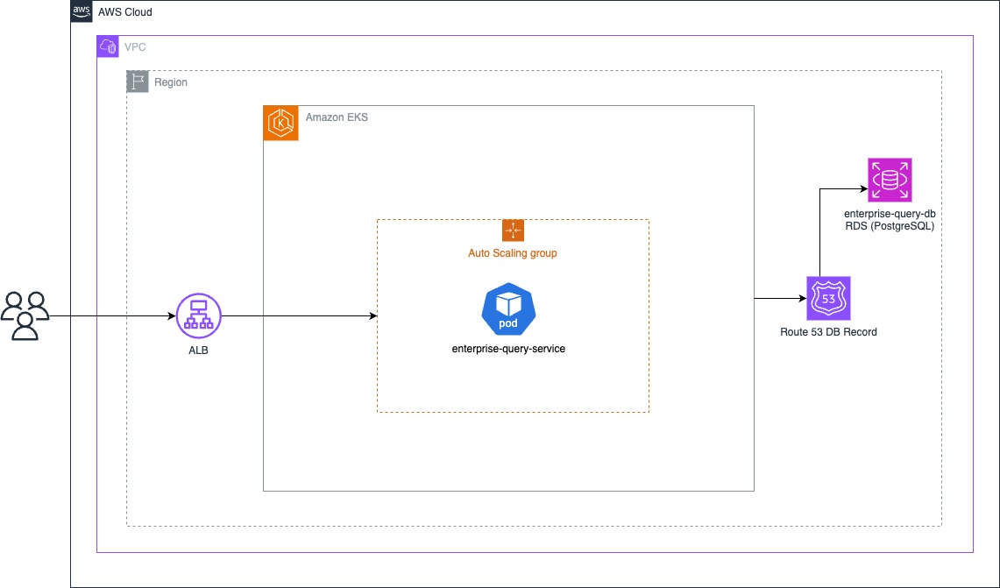

# AWS EKS MongoDB Infrastructure

This Terraform project automates the provisioning of a robust and scalable infrastructure on AWS. It sets up an Amazon Elastic Kubernetes Service (EKS) cluster and deploys a RDS database, ensuring a high-performance environment for containerized applications and data management, also includes some Kubernetes template files to deploy a contanarized application exposing and load balancer to access through internet.

## Introduction

This project is designed to simplify the deployment of an EKS cluster and a MongoDB database on AWS. By using Terraform, the entire setup is automated, making it reproducible and manageable through code.

## Features

### Amazon EKS Cluster
- **Basic Network Infra**: Creating an isolated VPC, subnets and security group config for secure deployment over aws us-east-1 region.
- **EKS Cluster Creation**: Creates an EKS cluster for running Kubernetes applications, including basic setup of policies and aws roles.
- **Worker Nodes Configuration**: Configures worker nodes for the cluster.
- **Networking Setup**: Sets up networking, including VPC, subnets, and security groups.

### RDS Database
- **Rds Deployment**: Deploys a RDDS instance on AWS.

### Route 53 configuration
- **Route 53 Records**: Records to easily connect to rds instance.

### General Features
- **Scalability**: Easily scale the Kubernetes cluster and MongoDB instances based on workload requirements.
- **High Availability**: Leverages AWS services to ensure high availability and fault tolerance.
- **Security**: Implements security groups, IAM roles, and other security measures to protect the infrastructure.
- **Automation**: Uses Terraform to automate the entire setup, making it reproducible and manageable through code.

## Prerequisites
- **Terraform**: [Install Terraform](https://www.terraform.io/downloads.html).
- **AWS Account**: An AWS account with appropriate permissions to create resources.
- **AWS CLI**: [Install and configure AWS CLI](https://docs.aws.amazon.com/cli/latest/userguide/install-cliv2.html) with your AWS credentials.
- **MongoDB Self Signed Certificates**: [Create x.509 Certificates](https://github.com/manuelrojas19/aws-infra-k8s-mongo/blob/main/docs/certificates.md): for MongoDB.

## Infraestructure Architecture Diagram



## Usage

1. **Clone the repository**:
    ```sh
    git clone https://github.com/manuelrojas19/konfio-enterprise-infra
    cd terrafom
    ```

2. **Initialize Terraform**:
    ```sh
    terraform init
    ```

3. **Review and edit configuration variables** in `variables.tf` as needed.

4. **Apply the Terraform configuration**:
    ```sh
    terraform apply
    ```

    - Confirm the apply action by typing `yes` when prompted.

5. **Access your EKS cluster** using the AWS CLI or Kubernetes tools like `kubectl`.

## Configuration

The configuration is managed through the `variables.tf` file. Key parameters include:

- **AWS Region**: The AWS region where the resources will be deployed.
- **Cluster Name**: The name of the EKS cluster.
- **Node Instance Type**: The instance type for the worker nodes.
- **RDS Configuration**: Parameters for MongoDB deployment, such as instance size and backup settings.

## Aplication Deployment

Once the infraestructure is provided and return a cluster information you can use the following commands to provision application


1. **Setup Kubectl CLI**:
    ```sh
    aws eks --region $(terraform output -raw region) update-kubeconfig \
    --name $(terraform output -raw cluster_name)

    cd kubernetes/

    kubectl apply -f secrets.yaml
    kubectl apply -f deployment.yaml
    kubectl apply -f service-loadbalancer.yaml
    ```

## TODO

- CI/CD Integration
- EKS Cluster SSL/TLS Configuration
- Kafka Integration
- Regional Resilence, deploying in more than just one aws region, currently just deploying on us-east-1


## License

This project is licensed under the MIT License. See the [LICENSE](LICENSE) file for details.

## Contributing

Contributions are welcome! Please submit a pull request or open an issue to discuss your ideas.